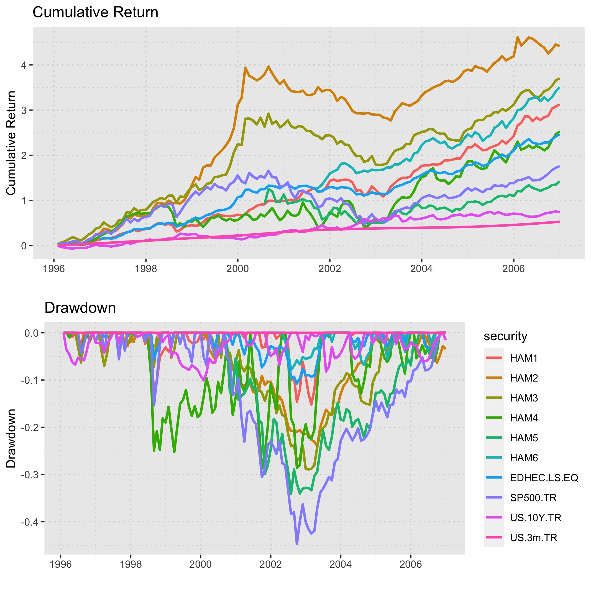

# pyformanceanalytics

<a href="https://pypi.org/project/pyformance-analytics/">
    
</a>

A python wrapper around the [PerformanceAnalytics R package](https://github.com/braverock/PerformanceAnalytics).

## Dependencies :globe_with_meridians:

Python:

- [rpy2](https://rpy2.github.io/)
- [pandas](https://pandas.pydata.org/)
- [Pillow](https://pillow.readthedocs.io/en/stable/reference/Image.html)
- numpy

R:

- [PerformanceAnalytics](https://github.com/braverock/PerformanceAnalytics)
- [ggplot2](https://ggplot2.tidyverse.org/)
- [gridExtra](https://cran.r-project.org/web/packages/gridExtra/index.html)

## Installation :inbox_tray:

This is a python package hosted on pypi, so to install simply run the following command:

`pip install pyformance-analytics`

## Usage example :eyes:

To get familiar with the individual functions and charts check out the documents in the [pyformanceanalytics README](pyformanceanalytics/README.md).

This supports both tables, functions and charts. An example of generating a chart:

```python
import pandas as pd
from pyformanceanalytics.charts import PerformanceSummary

df = pd.read_csv("pyformanceanalytics/managers.csv", index_col=0)
df.index = pd.to_datetime(df.index)
PerformanceSummary(df).show()
```



This outputs a `PIL` image, which automatically shows on colab instances.

## License :memo:

The project is available under the [GPL2 License](LICENSE).
