# pyformanceanalytics.chart

These examples will draw on the following datasets:

```python
import pandas as pd

df = pd.read_csv("pyformanceanalytics/managers.csv", index_col=0)
df.index = pd.to_datetime(df.index)
weights_df = pd.read_csv("pyformanceanalytics/weights.csv", index_col=0)
```

## Functions

The following functions are supported:

### ACF

Creates an ACF chart

```python
from pyformanceanalytics.chart import ACF

R = df[["HAM1"]]
ACF(R).show()
```

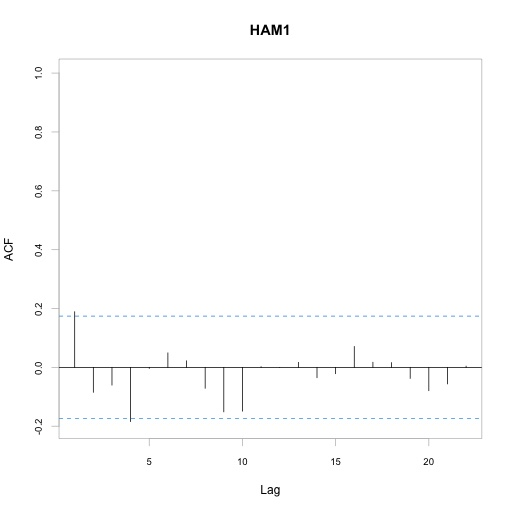

### ACFplus

Creates an ACF plus chart

```python
from pyformanceanalytics.chart import ACFplus

R = df[["HAM1"]]
ACFplus(R).show()
```

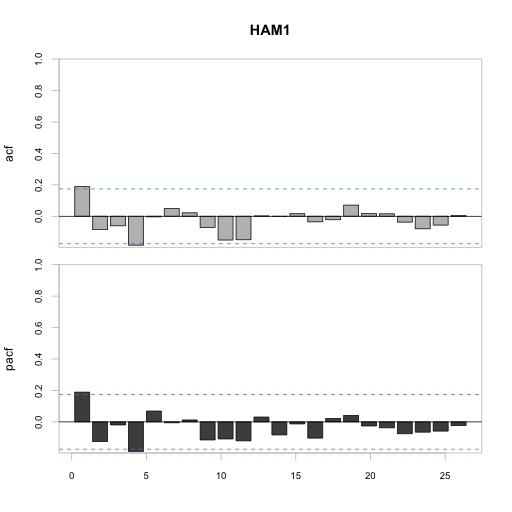

### Bar

Creates a bar returns chart

```python
from pyformanceanalytics.chart import Bar

R = df[["HAM1"]]
Bar(R).show()
```

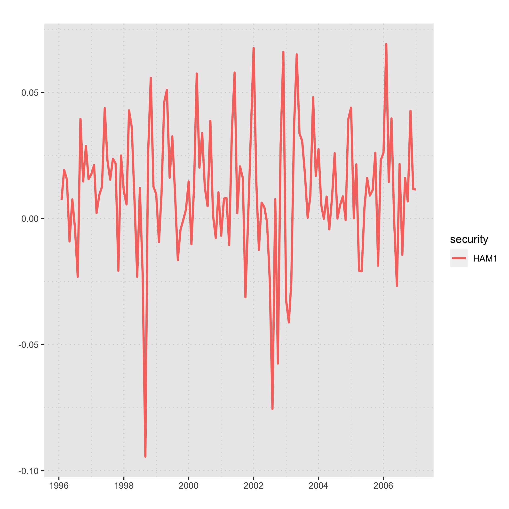

### BarVaR

Plots the periodic returns as a bar chart overlayed with a risk metric calculation

```python
from pyformanceanalytics.chart import BarVaR

R = df[["HAM1"]]
BarVaR(R).show()
```

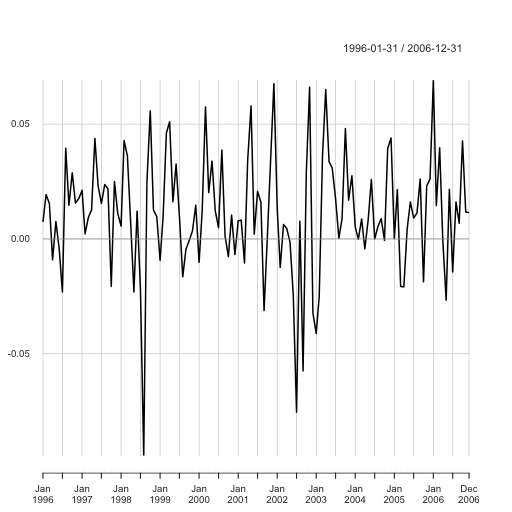

### Boxplot

Creates a boxplot chart

```python
from pyformanceanalytics.chart import Boxplot

R = df[["HAM1"]]
Boxplot(R).show()
```

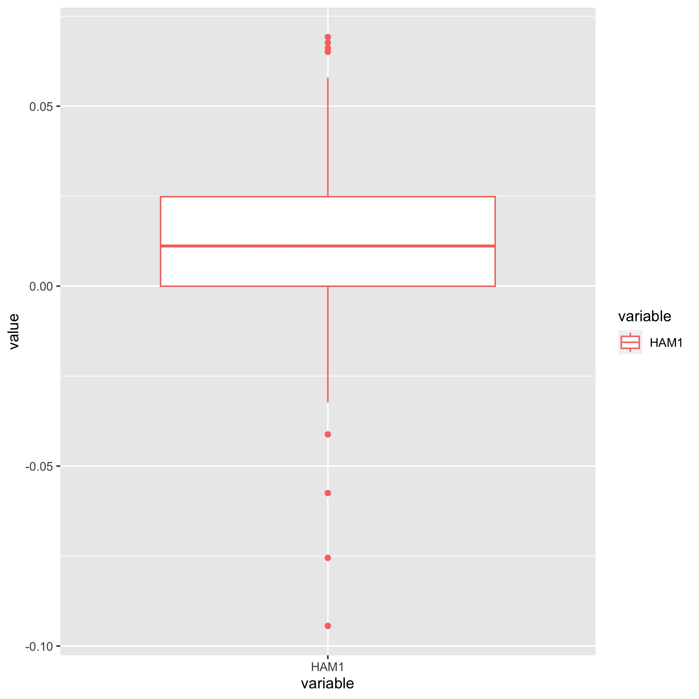

### CaptureRatios

Creates a boxplot chart

```python
from pyformanceanalytics.chart import CaptureRatios

Ra = df[["HAM1"]]
Rb = df[["SP500 TR"]]
CaptureRatios(Ra, Rb).show()
```

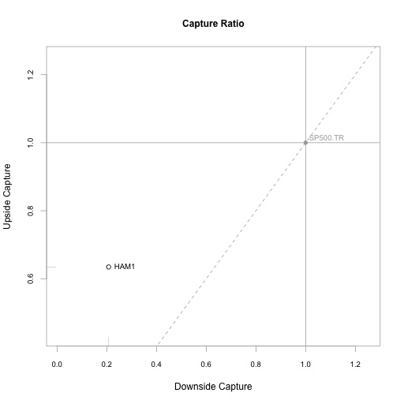

### Correlation

Scatter plot of Up Capture versus Down Capture against a benchmark

```python
from pyformanceanalytics.chart import Correlation

Correlation(df).show()
```

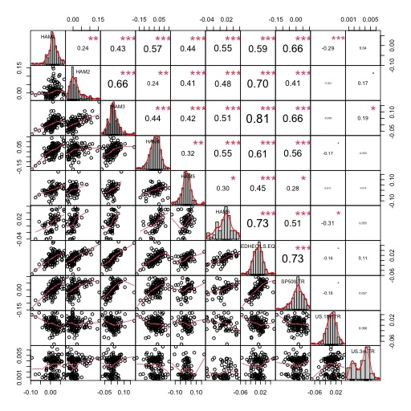

### CumReturns

Chart that cumulates the periodic returns given and draws a line graph of the results as a "wealth
index".

```python
from pyformanceanalytics.chart import CumReturns

CumReturns(df).show()
```

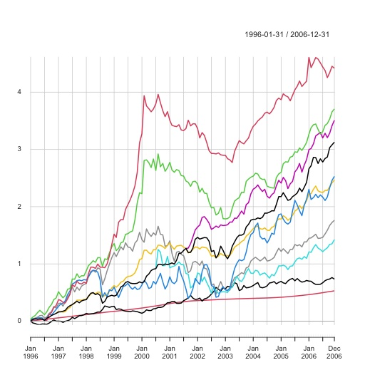

### Drawdown

Chart that cumulates the periodic returns given and draws a line graph of the results as a "wealth
index".

```python
from pyformanceanalytics.chart import Drawdown

Drawdown(df).show()
```

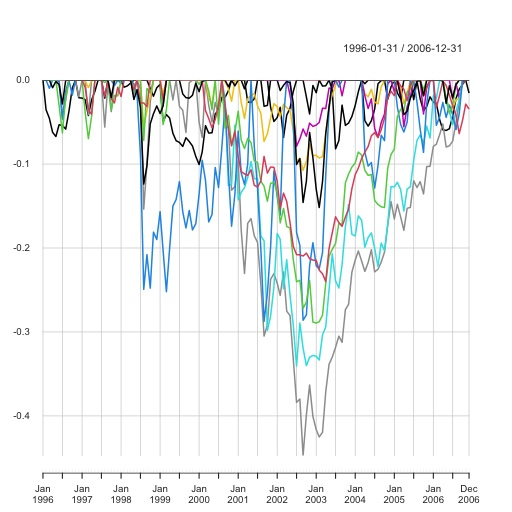

### ECDF

Creates an emperical cumulative distribution function (ECDF) overlaid with a cumulative distribu-
tion function (CDF)

```python
from pyformanceanalytics.chart import ECDF

ECDF(df).show()
```

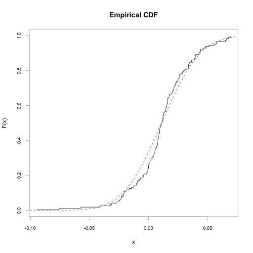

### Events

Creates a time series plot where events given by a set of dates are aligned, with the adjacent prior
and posterior time series data plotted in order

```python
import datetime
from pyformanceanalytics.chart import Events

Ra = df[["HAM1"]]
Events(Ra, [datetime.date(2006, 8, 31)]).show()
```

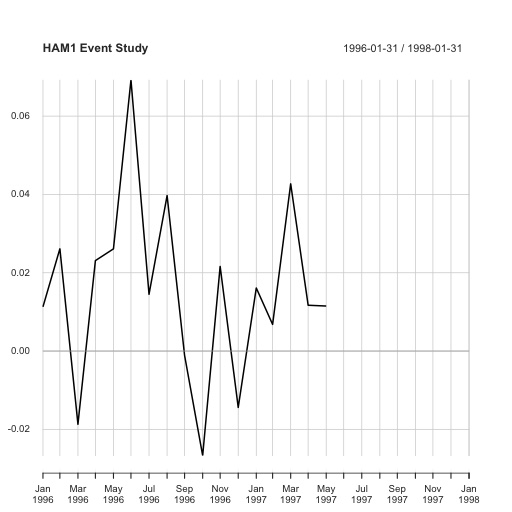

### Histogram

Create a histogram of returns, with optional curve fits for density and normal

```python
from pyformanceanalytics.chart import Histogram

Histogram(df).show()
```

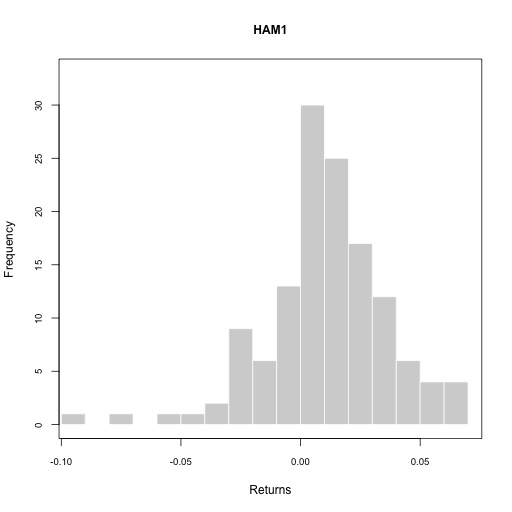

### QQPlot

Plot the return data against any theoretical distribution

```python
from pyformanceanalytics.chart import QQPlot

QQPlot(df).show()
```

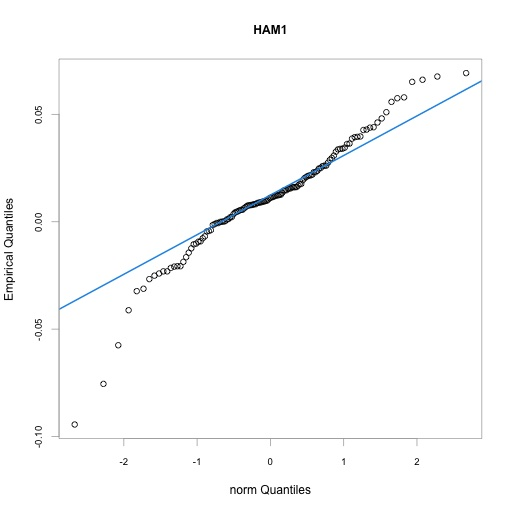

### Regression

Uses a scatterplot to display the relationship of a set of returns to a market benchmark

```python
from pyformanceanalytics.chart import Regression

Ra = df[["HAM1"]]
Rb = df[["SP500 TR"]]
Regression(Ra, Rb).show()
```

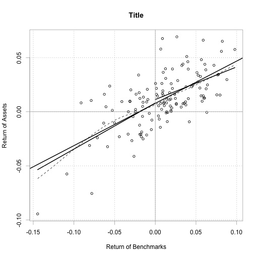

### RelativePerformance

Plots a time series chart that shows the ratio of the cumulative performance for two assets at each
point in time and makes periods of under- or out-performance easier to see

```python
from pyformanceanalytics.chart import RelativePerformance

Ra = df[["HAM1"]]
Rb = df[["SP500 TR"]]
RelativePerformance(Ra, Rb).show()
```

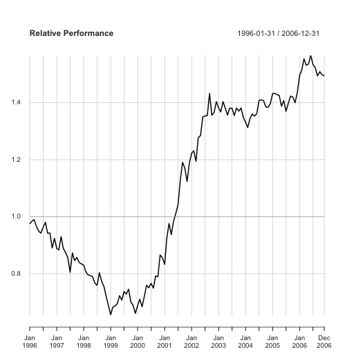

### RiskReturnScatter

Creates a scatter chart of annualized returns versus annualized risk (standard deviation)
for comparing manager performance

```python
from pyformanceanalytics.chart import RiskReturnScatter

RiskReturnScatter(df).show()
```

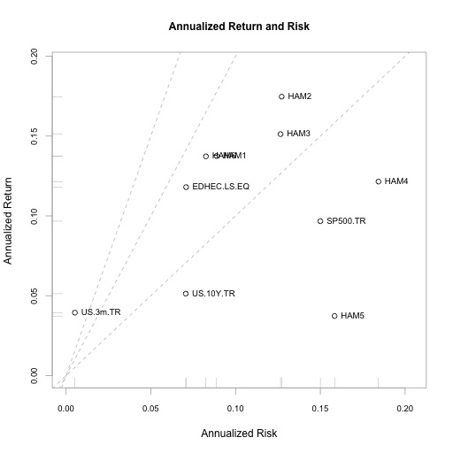

### RollingCorrelation

Creates a chart of rolling correlation metrics in a line chart

```python
from pyformanceanalytics.chart import RollingCorrelation

Ra = df[["HAM1"]]
Rb = df[["SP500 TR"]]
RollingCorrelation(Ra, Rb).show()
```

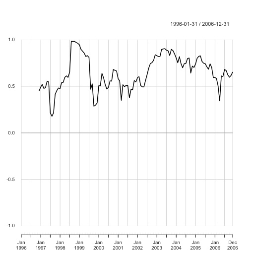

### RollingMean

Creates a rolling mean return chart

```python
from pyformanceanalytics.chart import RollingMean

RollingMean(df).show()
```

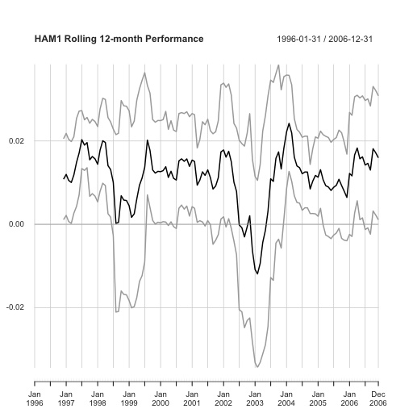

### RollingPerformance

Creates a chart of rolling performance metrics in a line chart

```python
from pyformanceanalytics.chart import RollingPerformance

RollingPerformance(df).show()
```

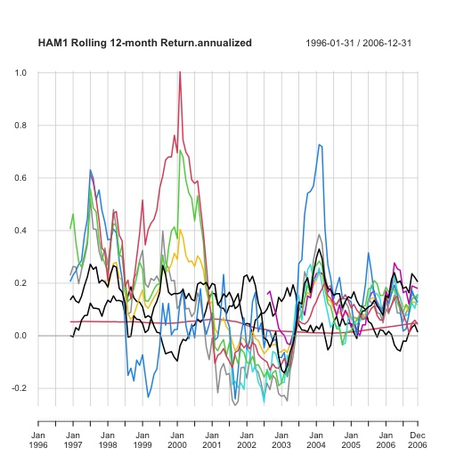

### RollingQuantileRegression

Creates a chart of relative regression performance through time

```python
from pyformanceanalytics.chart import RollingQuantileRegression

Ra = df[["HAM1"]]
Rb = df[["SP500 TR"]]
RollingQuantileRegression(Ra, Rb).show()
```

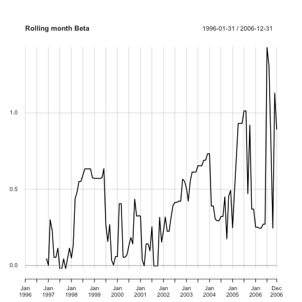

### SnailTrail

A chart that shows rolling calculations of annualized return and annualized standard deviation have
proceeded through time

```python
from pyformanceanalytics.chart import SnailTrail

SnailTrail(df).show()
```

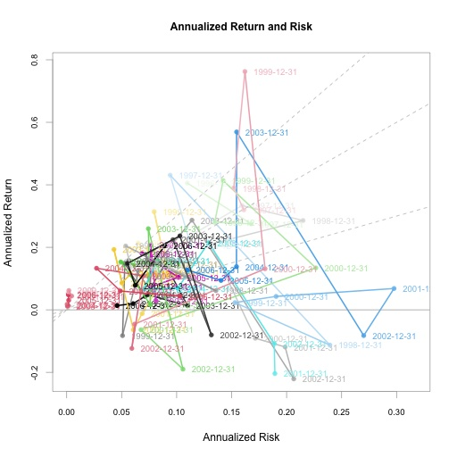

### StackedBar

This creates a stacked column chart with time on the horizontal axis and values in categories

```python
from pyformanceanalytics.chart import StackedBar

StackedBar(weights_df).show()
```

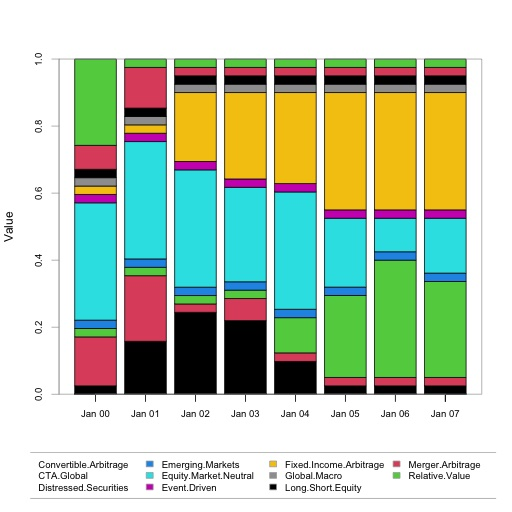

### VaRSensitivity

Creates a chart of Value-at-Risk and/or Expected Shortfall estimates by confidence interval for
multiple methods

```python
from pyformanceanalytics.chart import VaRSensitivity

VaRSensitivity(df).show()
```

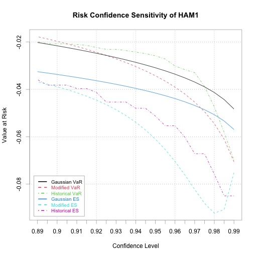
