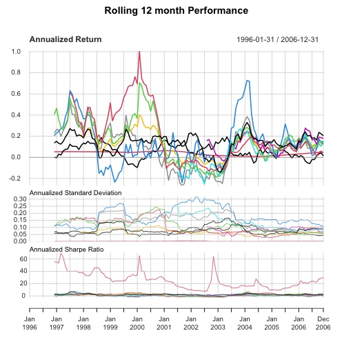

# pyformanceanalytics.charts

These examples will draw on the following datasets:

```python
import pandas as pd

df = pd.read_csv("pyformanceanalytics/managers.csv", index_col=0)
df.index = pd.to_datetime(df.index)
weights_df = pd.read_csv("pyformanceanalytics/weights.csv", index_col=0)
```

## Functions

The following functions are supported:

### PerformanceSummary

For a set of returns, create a wealth index chart, bars for per-period performance, and underwater
chart for drawdown

```python
from pyformanceanalytics.charts import PerformanceSummary

PerformanceSummary(df).show()
```


### RollingPerformance

Creates a rolling annualized returns chart, rolling annualized standard deviation chart,
and a rolling annualized sharpe ratio chart

```python
from pyformanceanalytics.charts import RollingPerformance

RollingPerformance(df).show()
```


